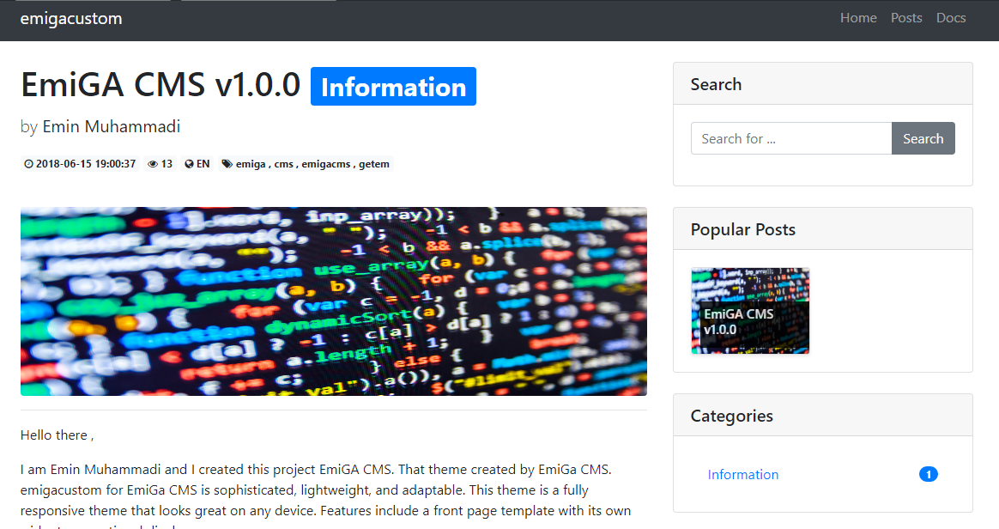

# EmiGA CMS by Emin Muhammadi


Hello there ,

I am [Emin Muhammadi](https://www.facebook.com/emiga.mohammadi) and I created this project [EmiGA CMS](http://www.getemigacms.ml). That theme created by [EmiGA CMS](http://www.getemigacms.ml). emigacustom for EmiGa CMS is sophisticated, lightweight, and adaptable. This theme is a fully responsive theme that looks great on any device. Features include a front page template with its own widgets, an optional display.

```
## You need to set up

* PHP (Tested on PHP7)
* MySQL

```
### Configuration
## 1) Install at *db/db.sql*
## 2) Configure database at *edit/db_con.php*
```
	$servername="yourServerName";
	$username="yourUserName";
	$password="yourPassword";
	$db="yourDatabase";
```
## 3) Configure database at *edit/config.php*
```
$allowRegister="0";  // Allow users  register in admin section
$allowCache="0"; // Allow Cache
$allowComment="0";  // Allow Comment Plugin (Disqus)
$allowGoogle="0"; //Allow Google plugin

//Google contains Google Analytics and Google Tag Manager
$GoogleAnalytics="yourKey"; 
$GoogleTagManager="yourKey"; 

$oneSignal="yourKey";  // Allow OneSignal
$shortname="yourShortName"; //  Enter Disquis shortname

```
## 4) Select theme at *edit/config.php*
```
Custom installation contains *emigacustom* theme

$theme_name="emigacustom"; //Enter your theme folder name [ATTENTION]
```

Okay I want to show project step by step

### Step 1.      
Default installation emigacustom theme


### Step 2.
EmiGA CMS support Disquis AddToAny GoogleAnalytics GoogleTagManager OneSignal and etc.


### Step 3.
EmiGa CMS in emigacustom theme you can configure widget (search bar , popular posts , categories list)



### Step 4.
Add post in cms administration section 


### Step 5.  
Edit, Delete any post


### Step 6.
Edit , Delete , Add categories


### Step 7. 
Edit and Delete permantly your profile


and other configure in dashboard section .
